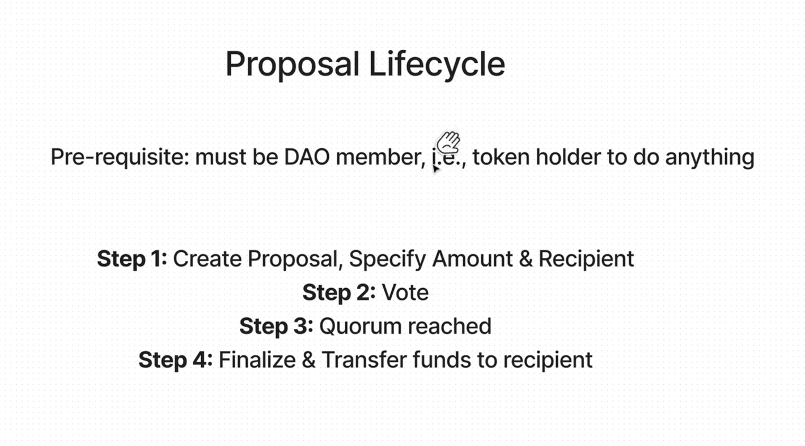

# DAO

Purpose: Governs Treasury

A decentralized autonomous organization (DAO) is an emerging form of legal structure. With no central governing body, every member within a DAO typically shares a common goal and attempt to act in the best interest of the entity. Popularized through cryptocurrency enthusiasts and blockchain technology, DAOs are used to make decisions in a bottoms-up management approach.




```shell
npx hardhat test
npx hardhat node
npx hardhat run --network localhost scripts/deploy.js
```
